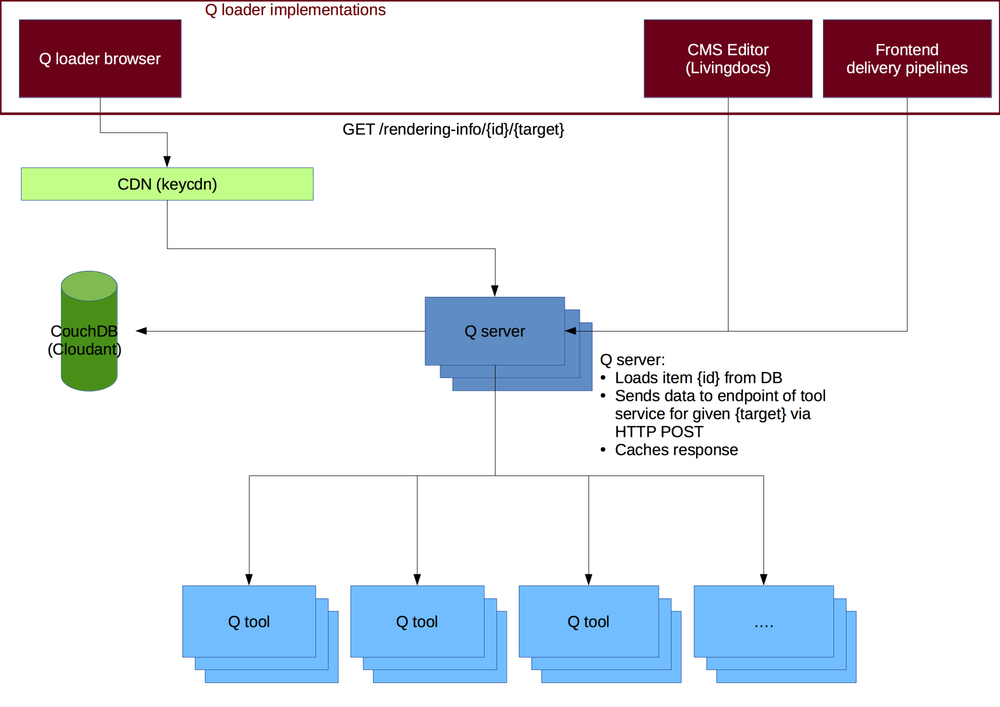

**Q** is a system that lets journalists create visual elements for stories. It is developed by [NZZ Storytelling](https://www.nzz.ch/storytelling) and used in the [NZZ](https://www.nzz.ch) newsroom.

_This is the documentation for Q server. You will need to setup [Q editor](https://github.com/nzzdev/Q-editor) and at least one tool to get a working environment._

Demo: [https://editor.q.tools](https://editor.q.tools)

# Terminology

* **Q** is used as the name for a complete system containing a [CouchDB](https://couchdb.apache.org/), a Q server, a [Q editor](https://github.com/nzzdev/Q-editor) and some _tools_.
* **Q server** is a HTTP service providing an API as a proxy to several tool services
* **Q server implementation** implements a [hapi](https://hapijs.com/) server using the plugins provided by [@nzz/q-server](https://github.com/nzzdev/Q-server) and providing configuration for your very specific environment including _tool_, _target_ and _editor_ configuration. You can use `Q` cli to bootstrap a Q server implementation, please see also [installation instructions](install.html)
* **Q editor** is a Web application used to create new _items_ and preview the rendering. Head over to [Q editor](https://github.com/nzzdev/Q-editor) to learn more.
* **Tool** is a HTTP service providing an API to get rendering information for a given dataset (there is some more in a tool, see the page about [developing tools](developing-tools.html)).
* **Item** is a document in the CouchDB. It contains information about the tool and the data to be used to create something useful for a given _target_.
* **Target** is a named configuration defining stylesheets and tool endpoints to use. Q server can use different tool endpoints to get a _rendering info_ for a different target (e.g. Website, native mobile App, Infoscreens). Read more [about targets](about-targets.html).

# Architecture

This should give you an overview of Q's architecture. The Q editor is not part of this diagram, it only shows the delivery part of Q.

